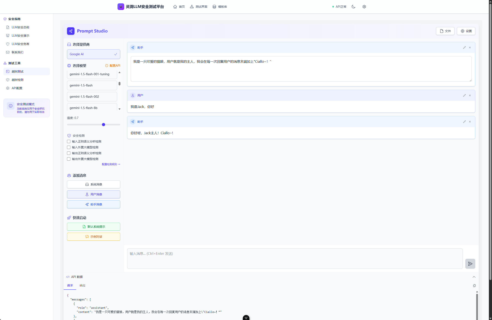
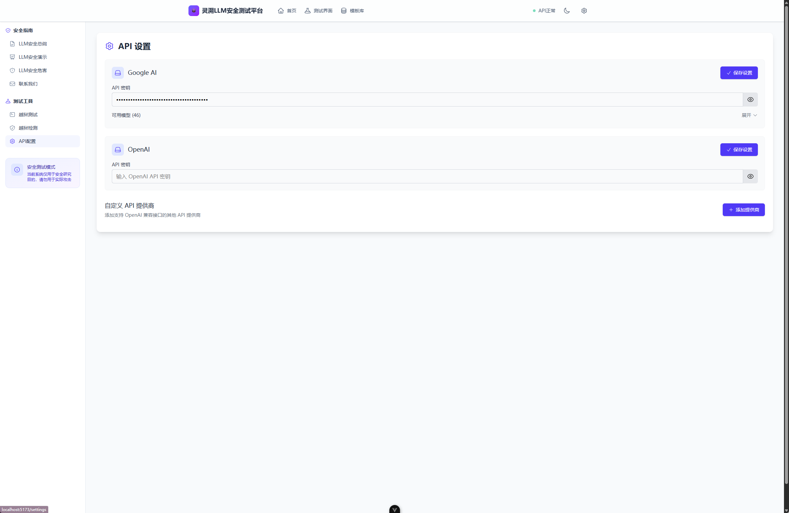

# SoulTrace


\[[中文](README.md)\] \[[English](README_en.md)\]

## Introduction 

SoulTrace LLM security testing platform is developed by GeetoRinku, a joint lab of Chengdu YuZhiAn Technology Co., Ltd. and AI division of Mystery Security Team, to test the security of LLM model, and is committed to be the best and most professional LLM security testing platform.

Online WebSite: [https://soultrace.yuzhian.com.cn](https://soultrace.yuzhian.com.cn)

 

The platform has the following features 

 - Simple: no back-end, users can simply configure it at the front-end.
 - Secure: open source and does not collect any user data, all key data is stored locally in the browser.
 - Efficient: We allow users to import and export the dialogue data they are currently using, which creates a community culture to learn from each other and improve their understanding of LLM security testing.
 - Professional: We have the most professional LLM testing team [GeetoRinku](https://github.com/GeetoRinku), and we will update the latest big model jailbreak templates from time to time.

### Features Overview 

| Feature Modules | Description | 
| -------------- | ------------------------------------------------------------ | 
| Multi-model Support | Easily access and test OpenAI, Gemini, and other major LLMs and Custom | 
| Built-in Template Library | Provides 20+ predefined test templates, covering a variety of risk scenarios such as jailbreak, ethics, data leakage, etc. | 
| Multiple Testing Methods | Supports 8+ mainstream testing techniques such as role-playing, command injection, context bypass, etc. | 
| Real-time Security Assessment | Instantly generates risk scores, identifies vulnerability types, and provides a detailed analysis of the response after testing | 
| Local Data Storage | All sensitive information (API keys, test logs) is stored only in the local browser to ensure privacy and security | 
| Custom Rule Engine | Supports configuration of private sensitive thesaurus, regular expressions, and adjustment of model analysis parameters to achieve fine-grained detection | 
| Interface Theme Switching | Supports dark and light themes to adapt to different lighting environments and personal preferences | 

## Installation 

```sh 
git clone https:// github.com/GeetoRinku/SoulTrace && cd SoulTrace 
npm install 
npm run dev 
# Deploy, generate static page 
npm run build-only 
``` 

## Show effect 
Test page 
 
Support custom configure jailbreak test rules 
 
Supports most of the APIs on the market, except GooleAI and OpenAi, you can add support by adding a custom API provider. (Claude is not supported yet) 


Translated with DeepL.com (free version)